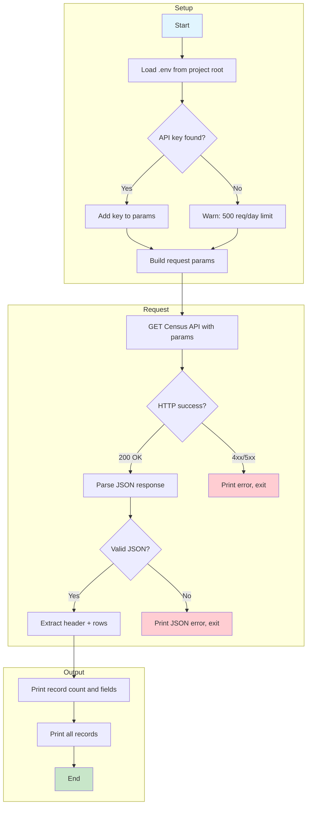

# U.S. Census Bureau API Query Script

> Documentation for [`my_good_query.py`](my_good_query.py) — State population data from the American Community Survey (ACS 5-year). Pairs with [LAB_your_good_api_query.md](LAB_your_good_api_query.md).

---

## Overview

This script queries the **U.S. Census Bureau Data API** to retrieve total population estimates for 20 states from the 2022 American Community Survey (ACS) 5-year estimates. It demonstrates loading credentials from `.env`, building a parameterized request, handling errors, and documenting the returned data.

**Use case:** Geographic data suitable for reporting applications, demographic analysis, or building datasets for visualization.

---

## API Endpoint and Parameters

| Property | Value |
|----------|-------|
| **API** | U.S. Census Bureau Data API |
| **Base URL** | `https://api.census.gov/data/2022/acs/acs5` |
| **Method** | `GET` |
| **Auth** | Optional; `key` query parameter (500 requests/day without key) |

### Query Parameters

| Parameter | Required | Description |
|-----------|----------|-------------|
| `get` | Yes | Comma-separated variable names: `NAME,B01001_001E` (geography name, total population) |
| `for` | Yes | Geography filter: `state:01,02,04,...` (FIPS state codes) |
| `key` | No | API key from [Census Key Signup](https://api.census.gov/data/key_signup.html); set as `TEST_API_KEY` in `.env` |

### States Included (20 FIPS codes)

`01,02,04,05,06,08,09,10,11,12,13,16,17,18,19,20,21,22,23,24`  
(AL, AK, AZ, AR, CA, CO, CT, DE, DC, FL, GA, ID, IL, IN, IA, KS, KY, LA, ME, MD)

---

## Data Structure

The Census API returns a **JSON array** where:

- **Row 0:** Column names (header)
- **Rows 1–N:** Data rows

### Column Definitions

| Column | Description |
|--------|-------------|
| `NAME` | Geography name (e.g., "Alabama", "California") |
| `B01001_001E` | Total population estimate |
| `state` | 2-digit FIPS state code |

### Example Response Shape

```json
[
  ["NAME", "B01001_001E", "state"],
  ["Alabama", "5118464", "01"],
  ["Alaska", "733406", "02"],
  ["Arizona", "7245928", "04"],
  ...
]
```

---

## Process Flow



---

## Usage Instructions

### Prerequisites

- Python 3.7+
- Packages: `requests`, `python-dotenv`

```bash
pip install requests python-dotenv
```

### Optional: API Key

1. Get a free key: [Census API Key Signup](https://api.census.gov/data/key_signup.html)
2. Create `.env` in the **project root** (parent of `01_query_api/`):

   ```
   TEST_API_KEY=your_census_api_key_here
   ```

3. No quotes or spaces; the script loads this automatically.

### Run the Script

From the **project root**:

```bash
python3 01_query_api/my_good_query.py
```

From inside `01_query_api/`:

```bash
cd 01_query_api
python3 my_good_query.py
```

### Expected Output

```
Number of records: 20
Key fields per record: ['NAME', 'B01001_001E', 'state']
Data structure: list of 20 state-level rows (geographic data); first row is header, each row is [NAME, B01001_001E, state].

All records:
  1. NAME=Alabama, B01001_001E=5028092, state=01
  2. NAME=Alaska, B01001_001E=734821, state=02
  3. NAME=Arizona, B01001_001E=7172282, state=04
  4. NAME=Arkansas, B01001_001E=3018669, state=05
  5. NAME=California, B01001_001E=39356104, state=06
  ... (20 states total)
```

### Troubleshooting

| Issue | Action |
|-------|--------|
| `Invalid Key` | Ensure `TEST_API_KEY` is set correctly in `.env` at project root |
| 403 Forbidden | Check API key and rate limits |
| No `.env` | Script runs without key (500 requests/day); add key for higher limits |

---

## Related Files

- [LAB_your_good_api_query.md](LAB_your_good_api_query.md) — Lab assignment
- [my_good_query.py](my_good_query.py) — Script source
- [READ_find_apis.md](READ_find_apis.md) — Finding APIs
- [ACTIVITY_your_api.md](ACTIVITY_your_api.md) — Finding API documentation

---


---

← 🏠 [Back to Top](#u-s-census-bureau-api-query-script)
