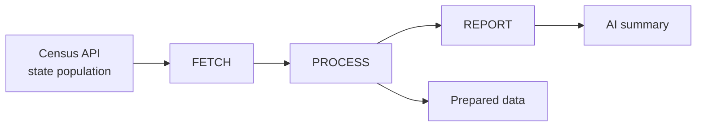

# Census AI Reporter — Process Diagram & Stakeholder Mapping

## 🧱 Process Diagram (Mermaid)

**Steps (what the tool does):**

| Step   | What happens |
|--------|-------------------------------|
| **FETCH**   | Request Census API (ACS 5-year, 20 states); get raw JSON (header + rows). |
| **PROCESS** | Parse rows → clean (population as int, sort) → aggregate (total, top 5, bottom 5) → format as text for the prompt. |
| **REPORT**  | Send formatted data + prompt to LLM (Ollama or OpenAI); get model response. |

**Inputs:** Census API (endpoint, state codes; optional API key). AI backend choice (Ollama / OpenAI).  
**Outputs:** Prepared data (totals, top/bottom 5 states). AI report (2–3 sentence summary + 5 bullet insights).

---

## Stakeholder needs → system goals

| Stakeholder need | System goal |
|------------------|-------------|
| Get state population data without manual download | **FETCH** from Census API with a single script run. |
| See cleaned, comparable numbers (totals, extremes) | **PROCESS**: clean, aggregate, and show prepared data. |
| Get a short written summary and insights, not raw rows | **REPORT**: send aggregated data to AI; return summary + bullets. |
| Use local or cloud AI (Ollama / OpenAI) | Support multiple backends via config (e.g. `AI_BACKEND` in `.env`). |
