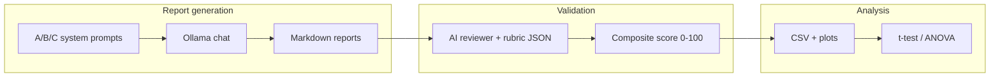

# Homework 3 Documentation — Wedding Report Validation System

Repository: [PhilipGuRX/dsai](https://github.com/PhilipGuRX/dsai)

## Git links (for your .docx)

| Item | Link |
|------|------|
| Validation script | [hw3_report_validator.py](https://github.com/PhilipGuRX/dsai/blob/main/11_decision_support/hw3_report_validator.py) |
| Rubric / criteria | [hw3_validation_rubric.md](https://github.com/PhilipGuRX/dsai/blob/main/11_decision_support/hw3_validation_rubric.md) |
| Example validation outputs | [hw3_outputs/](https://github.com/PhilipGuRX/dsai/tree/main/11_decision_support/hw3_outputs) |
| Reports validated (activity) | [stage1_wedding_decider.md](https://github.com/PhilipGuRX/dsai/blob/main/11_decision_support/activity_outputs/stage1_wedding_decider.md), [stage2_wedding_decider.md](https://github.com/PhilipGuRX/dsai/blob/main/11_decision_support/activity_outputs/stage2_wedding_decider.md) |
| Report generator (HW2/agent context) | [activity_wedding_decider.py](https://github.com/PhilipGuRX/dsai/blob/main/11_decision_support/activity_wedding_decider.py) |

## Validation criteria table

See [hw3_validation_rubric.md](hw3_validation_rubric.md) for the full table. Summary:

| Dimension | Scale | Benchmark |
|-----------|-------|-----------|
| Priority alignment | 0–100 | ≥ 75 |
| Table coverage | 0–16 venues | 16/16 |
| Source fidelity | 0–100 | ≥ 85 |
| Structure compliance | 0–3 checklist | 3/3 |
| Exclusion quality | 0 or 1 | 1 |
| **Composite** | 0–100 (weighted) | ≥ 70 |

**Difference from LAB:** Module 9 LAB uses generic 1–5 Likert traits (formality, succinctness, etc.). This system scores **decision-report quality** for wedding venues: priority fit, full table coverage, and structured sections.

## Experimental design

| Prompt | Style | Purpose |
|--------|-------|---------|
| **A** | Minimal | Baseline—short unstructured answer |
| **B** | Structured | Course template (table + top 3 + exclusion) |
| **C** | Checklist | B plus explicit priority checklist and anti-hallucination rules |

- **Reports per prompt:** 6 (default; set `HW3_REPORTS_PER_PROMPT`)
- **Total validation scores:** 18 (one composite per generated report)
- **Client priorities:** Stage 1 from `activity_wedding_decider.py` (budget $8k, ~120 guests, romantic, outdoor, catering rules)
- **Ground truth:** Same 16 venue descriptions for every run

## Statistical analysis

After `validation_scores.csv` is written, the script runs:

1. **Descriptive statistics** — mean and SD of `composite_score` by prompt  
2. **Bartlett’s test** — homogeneity of variance across A, B, C  
3. **Independent t-test** — highest vs. second-highest mean prompt (Welch if variances differ)  
4. **One-way ANOVA** — omnibus test that at least one prompt differs  

**Hypotheses (example):**

- H₀: Mean composite validation score is equal across prompts A, B, C.  
- H₁: At least one prompt mean differs.

Report **F**, **p-value**, and which prompt has the highest mean. If ANOVA p < 0.05, cite the t-test between the top two prompts.

## System design



The **AI reviewer** is a second model call with temperature 0.2 and JSON output. It receives priorities, source venues, and the report, then returns rubric dimensions. Python recomputes `composite_score` with fixed weights so scoring stays consistent.

## Technical details

| Setting | Default |
|---------|---------|
| API | Local Ollama `http://127.0.0.1:11434/api/chat` |
| Model | `smollm2:1.7b` default (override with `OLLAMA_MODEL`; `llama3.2:latest` recommended if installed) |
| Timeout | 300s (`OLLAMA_TIMEOUT`) |

**Packages:** `pandas`, `requests`, `matplotlib`, `scipy`; optional `pingouin` (recommended, same as Module 9).

```bash
pip install pandas requests matplotlib scipy pingouin
```

**File structure:**

```
11_decision_support/
  hw3_report_validator.py      # main script
  hw3_validation_rubric.md       # rubric
  hw3_documentation.md           # this file
  hw3_outputs/
    validation_scores.csv
    statistical_summary.txt
    prompt_score_comparison.png
    generated_reports/           # prompt_A_run_01.md, etc.
  activity_outputs/              # existing reports (HW / activity)
```

## Usage instructions

1. **Start Ollama** and pull a JSON-friendly model, e.g. `ollama pull llama3.2:latest` (or use your installed model via `export OLLAMA_MODEL=smollm2:1.7b`).

2. **Validate one existing report** (quick test):

```bash
cd "11_decision_support"
python hw3_report_validator.py --step validate \
  --report activity_outputs/stage1_wedding_decider.md
```

3. **Run full experiment** (generate + validate + statistics):

```bash
python hw3_report_validator.py --step experiment --reports-per-prompt 6
```

4. **Re-run statistics only** (after CSV exists):

```bash
python hw3_report_validator.py --step stats
```

5. **Screenshots for Canvas:** terminal during run, `hw3_outputs/validation_scores.csv`, one `generated_reports/*.md`, rubric markdown, `statistical_summary.txt`, and `prompt_score_comparison.png`.

6. **Assemble .docx:** paste writing component, embed screenshots, and add the git links table above.
